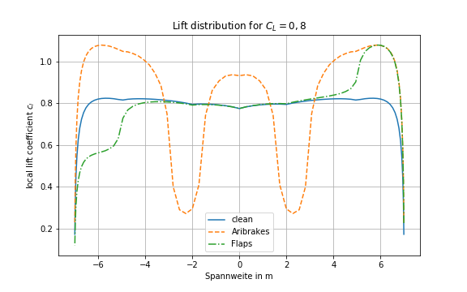
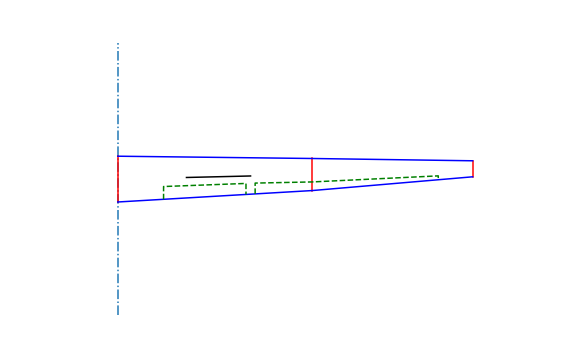

# wingstructure - an open source python tool assisting with certification of sailplane wings



[](https://wingstructure.readthedocs.io/en/latest/)


## Installation
pip can be used to install the package:
```sh
pip install https://github.com/helo9/wingstructure/archive/master.zip
```

## Usage

wingstructure has three primary functions

 * object oriented representation of wing geometry
 * lift and moment calculation based on multhopp quadrature
 * mass estimation for wing sections

 Those functions are briefly presented in the following:

### Creating a Wing
Create simple geometry:
```python
# create wing object
wing = data.Wing()

# add sections to wing
wing.add_section(data.Point(0.0, 0.0, 0.0), 1.0, 0.0)
wing.add_section(data.Point(0.05, 4.25, 0.0), 0.7, 0.0)
wing.add_section(data.Point(0.1, 7.75, 0.0), 0.35, 0.0)

# set fuselage with (=root of wing) to zero
wing.set_root_pos(0.0)

# define spoiler position
wing.set_spoiler(1.5, 2.9)

# define control-surfaces
wing.set_flap('flap', 1, 2.8,[0.7,0.7])
wing.set_flap('flap2', 4.25, 7, [0.7,0.8])

# display simple wing
plt.figure(figsize=(8,5))
wing.plot()
plt.savefig('wing.png')
```



### Calculating lift distribution
```python
from wingstructure import analysis

liftana = analysis.LiftAnalysis(wing)

α, distribution = liftana.calculate(lift=0.8)
```

### Estimating wing section's mass


An example calculation can be found in [example/MassEstimation](examples/Experimental_Mass_and_Structure.ipynb).

