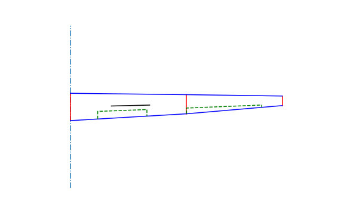

# wingstructure - an open source python tool assisting with certification of sailplane wings


[](https://wingstructure.readthedocs.io/en/latest/?badge=latest) [](https://travis-ci.com/akafliegdarmstadt/wingstructure) [](https://coveralls.io/github/akafliegdarmstadt/wingstructure?branch=master) [](https://www.codacy.com/app/helo9/wingstructure?utm_source=github.com&amp;utm_medium=referral&amp;utm_content=helo9/wingstructure&amp;utm_campaign=Badge_Grade)

## Installation
pip can be used to install the package:
```sh
pip install https://github.com/akafliegdarmstadt/wingstructure/archive/master.zip
```

## Usage

wingstructure has three primary functions

 * object oriented representation of wing geometry



 * lift and moment calculation based on multhopp quadrature
 * mass estimation for wing sections

 


 Those are briefly presented in the [Getting Started Guide](https://wingstructure.readthedocs.io/en/latest/usage/quickstart.html).

